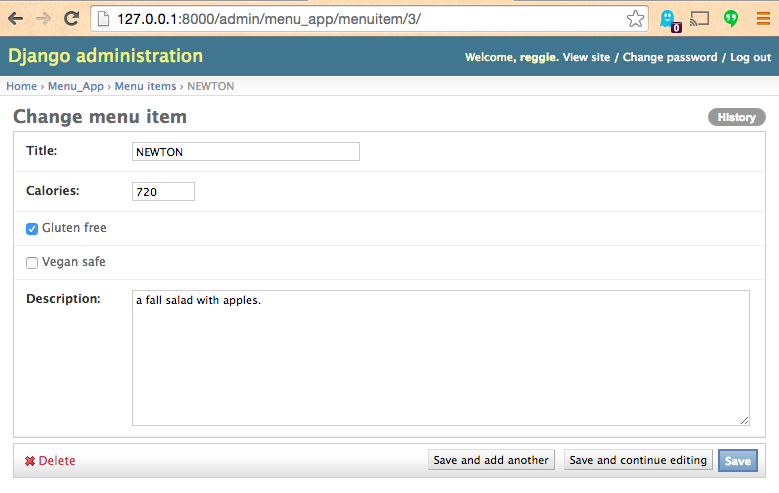
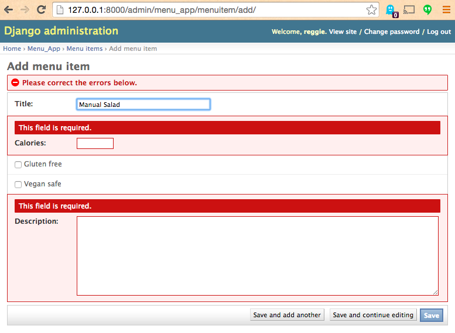
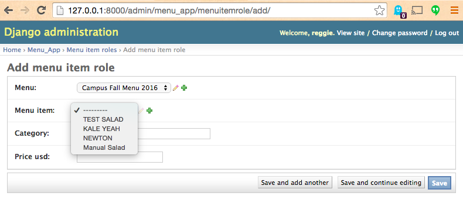

# Salad System (Django Implementation)

An example database-connected web app, using the [Django](https://www.djangoproject.com/) Python web application framework.

Represents a partial implementation of [Salad System Requirements](https://github.com/gwu-business/salad-system-requirements).

Based on [Salad System (Python Implementation)](https://github.com/gwu-business/salad-system-py),
 [Salad System (Flask Implementation)](https://github.com/gwu-business/salad-system-flask),
 and [Salad System (SQLAlchemy Implementation)](https://github.com/gwu-business/salad-system-alchemy).

## Usage

```` sh
git clone git@github.com:gwu-business/salad-system-django.git
cd salad-system-django/
````

Install package dependencies.

```` sh
pip install -r requirements.txt
````

Setup the database.

```` sh
mysql -uroot -p -e "DROP DATABASE IF EXISTS salad_system_db; CREATE DATABASE salad_system_db;"
python manage.py migrate
python manage.py populate_database
````

Setup an admin user.

```` sh
python manage.py createsuperuser
````

Run a local web server and visit http://localhost:8000/ in a browser.

```` sh
python manage.py runserver
````







## Developing

Use an interactive console for development.

```` sh
python manage.py shell
````

## [License](LICENSE)
